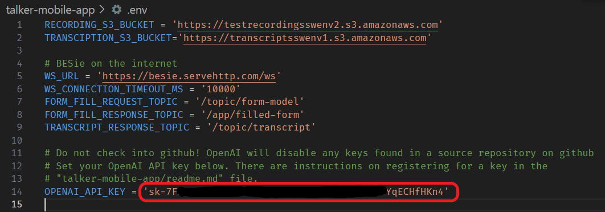

# ConvoBuddy

Mobile app for STeMS system

## Getting Started with Flutter

This project is a starting point for a Flutter application.

A few resources to get you started if this is your first Flutter project:

- [Lab: Write your first Flutter app](https://docs.flutter.dev/get-started/codelab)
- [Cookbook: Useful Flutter samples](https://docs.flutter.dev/cookbook)

For help getting started with Flutter development, view the
[online documentation](https://docs.flutter.dev/), which offers tutorials,
samples, guidance on mobile development, and a full API reference.

1. Run `flutter pub get` to install dependencies
2. Run `flutter run` to run the app

## Setting Up the .env File

ConvoBuddy and the backend_services package use a .env file deployed with the application to configure certain items such as AWS URLs, BESie topics, and the OpenAI API key.
As the API key must be private, it cannot be pushed to github. Thus the .env file is in the .gitignore and is not to be checked in. To build and run the project, you must get a complete copy of the .env file. 

The filled in development .env file with OpenAI API Key can be downloaded from Team B Files at:

https://umgcdev361.sharepoint.com/:u:/r/sites/SWEN670Summer2023/Shared%20Documents/Team%20B/.env.txt?csf=1&web=1&e=ahTvfA

*Note: Teams downloads the file as env.txt without the leading ".". Copy it to the talker-mobile-app folder and rename to .env*

## Getting an OpenAI API Key

This short video explains the process of creating a new key: https://youtu.be/EQQjdwdVQ-M?t=24

The following outlines setting up a new key and adding it to the .env created with the instructions above.

1. Go to https://openai.com and Login or Sign up for a new account. 
2. Click on API
3. At top right, click on Personal and then View API Keys menu item.
4. Click "+ Create new secret key" button
5. Give the key a name, relating to ConvoBuddy or SWEN670
6. The new secret key will appear in a text box with copy button next to it.
7. Copy the key and paste it into your .env file.

8. Save the key somewhere like OneNote where it will be safe, you cannot retrieve this key once you close this dialog. You can however make more.
9. Click done.

You should have $5 in credits to start with, which is ample for testing with the ChatGPT model 3.5 ConvoBuddy uses.
